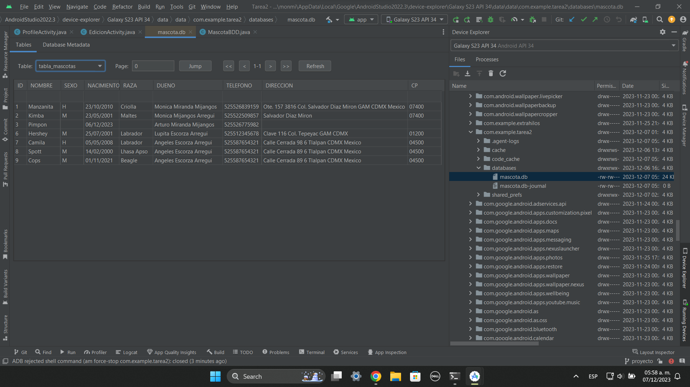

# pdm2024_1
Tareas y proyectos de Android Studio para la materia de Programación de Dispositivos Móviles.

Equipo:
* Gretel Penelope Cortés Macías
* Mónica Miranda Mijangos

Para consultar la Base de Datos y saber si la información fue almacenada correctamente,  
Android Studio tiene una función llamada ``Device Explorer`` que permite acceder  
a los archivos de nuestro dispositivo/emulador.

* Desde ``View`` -> ``Tool Windows`` -> ``Device Explorer``.
* Buscamos la carpeta ``/data/data/com.example.tarea2/databases``.

Allí encontremos nuestra base de datos ``mascota.db`` de SQLite.  
Puede descargarse y observarse con una herramienta externa, o bien,  
se puede utilizar el plugin de android studio para observar archivos con extensión ``.db``.

